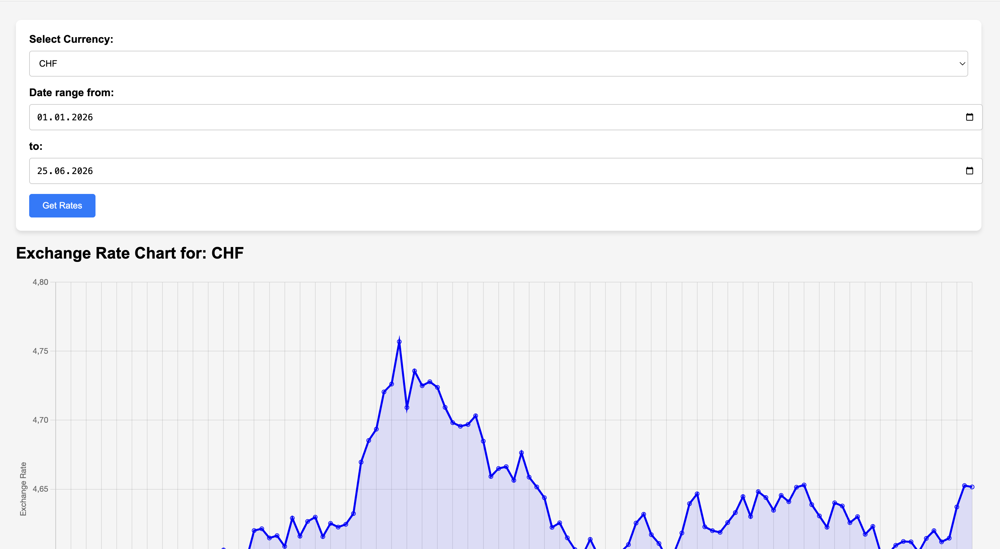

# Currency App

Fetches historical exchange rates from the [NBP API](https://api.nbp.pl/) (National Bank of Poland), stores them in a local database, and serves them through a web interface with an interactive chart.



## How it works

```
NBP API → loader.py (ETL) → SQLite DB → viewer.py (Flask) → Browser
```

- **loader.py** — fetches rates for configured currencies and date range, saves to DB (and optionally to files)
- **viewer.py** — Flask app for browsing rates by currency and date range, with a Chart.js line chart

## Tech stack

- Python, Flask, SQLAlchemy
- Chart.js
- Docker
- NBP public API (no key required)

## Setup

### 1. Clone and configure

```bash
git clone https://github.com/metju29/python-currency-app.git
cd python-currency-app
```

Edit `config.yaml` to set currencies and start date:

```yaml
currencies: [eur, usd, gbp]
start_date: "2024-01-01"
save_to_db: true
save_to_file: false
output_folder: rates
```

### 2. Load data

```bash
pip install -r requirements.txt
python loader.py
```

### 3. Run with Docker

```bash
docker build -t currency-app .
docker run -p 5000:5000 -v $(pwd)/rates.db:/app/rates.db currency-app
```

Open [http://localhost:5000](http://localhost:5000)

### 3. Run locally (without Docker)

```bash
python viewer.py
```
